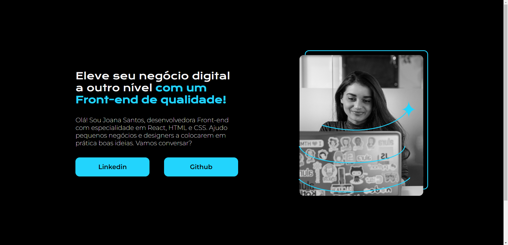

# Projeto Portifolio Alura

Projeto desenvolvido com o curso da Alura + One T6, nesse projeto aperfeiçoamos os conhecimentos em tag's e estilização no CSS.

## Tecnologia
- HTML
- CSS
- Figma

## Lnks:
[:link: Figma do Projeto](https://www.figma.com/file/4EKKCbr5rS93RWP7kRjXIz/Portfolio---Curso-1?type=design&node-id=0-1&mode=design&t=NxA0dSiTYCDKxkaQ-0)

[:link: Link do Projeto](https://projeto-portifolio-alura-three.vercel.app/)

